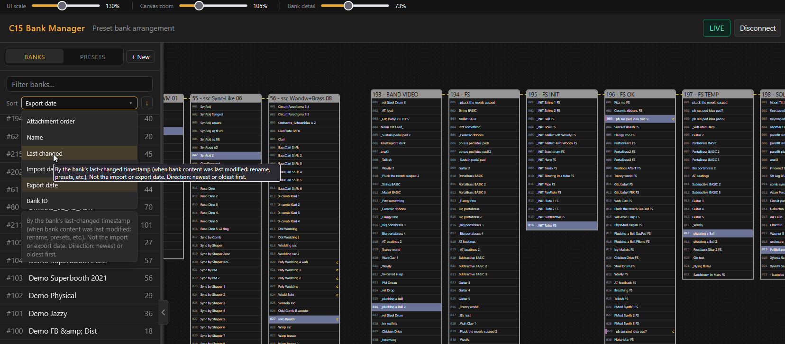

# C15 Offline Preset Manager

Browser preset manager for the Nonlinear Labs **C15**. Banks, presets, docks, and clusters use the same rules as the instrument. The differences:
- speed
- mass imports
- more detailed mouse-hover info fields
- ability to mix and match different backup files into one canvas.

You can edit fully offline on `.nlbackup` and bank XML, or connect the C15 over Wi‑Fi and run the same canvas against the live instrument. On GitHub Pages the app is always available offline. Live mode needs a small local pack (browsers block the C15’s plain `ws://` WebSocket from an HTTPS page).

**[Open the app](https://megagoth1702.github.io/C15-OfflinePresetManager/)**

As of 24 July 2026 the public C15 library lists **8,559** official and sound-designer presets. This tool is meant for libraries that size: import, merge, dock, search, multi-select, and export without doing that work on the instrument UI.

---

## Offline vs Live

|                           | Offline                     | Live                                                         |
| ------------------------- | --------------------------- | ------------------------------------------------------------ |
| How you start             | Open the app site above     | Local Live pack (next section)                               |
| Where the data comes from | Import `.nlbackup` / `.xml` | Connect to the C15 on your LAN                               |
| Who owns the library      | The file on your disk       | The instrument; the app mirrors it                           |
| How you leave with a file | Export whenever you want    | Export **while still connected** if you need full sound data |

Offline: import backups, rearrange the canvas, export a `.nlbackup` or individual bank XML. No instrument required.

Live: same canvas and editing tools, talking to the C15 on the local network. Layout and library changes go to the device. While connected, Undo and Redo call the instrument’s `/undo` endpoints instead of a separate local history.

---

## Local Live pack

Download from **[GitHub Releases (latest)](https://github.com/Megagoth1702/C15-OfflinePresetManager/releases/latest)**, unzip, then run `Start.bat` (Windows), `Start.command` (macOS), or `Start.sh` (Linux).

The pack serves the app at `http://localhost` so Connect can open a WebSocket to the C15. First run fetches a small official Node.js runtime once. Later starts can pull app updates from Releases.

GitHub Pages stays useful for offline import and export. It cannot host Live mode.

---

## Quick start

Offline:

1. Open the [app](https://megagoth1702.github.io/C15-OfflinePresetManager/).
2. Import banks (single or multiple `.xml`, folders, or `.nlbackup` files), merge or replace the canvas
3. Arrange, dock, search, rename, sort.
4. Export a session `.nlbackup` or one `.xml` per selected bank.

Live:

1. Start the Local Live pack from Releases.
2. Connect to the C15 on your network.
3. Edit on the browser UI; import what you wish, use merge or replace when you intend to change the device library.
4. Export while connected if you want an offline backup of the sounds on the instrument, then Disconnect.

---

## Docking Visual Changes

On the canvas, docked banks show golden header lines. In the sidebar, related banks share a golden border. Moving a parent moves its children. Proximity dock is pointer-aware: on release the app commits the cyan highlight under the cursor.

---

## Import

**Import files** accepts multiple `.xml` and `.nlbackup` files in one picker. **Import folder** walks subfolders (for example by sound designer), sorts banks inside each folder into right-attach chains, and packs those chains as separate groups.

Mass import always asks merge or replace. Merge adds to what is already on the canvas. Replace wipes the session first. Bad files show up in the dialog with a reason.

While Live, a successful import is sent to the device automatically. Merge runs sequential `import-bank` and keeps full preset bodies after the device assigns new UUIDs. Replace deletes every bank on the C15, waits, then uploads. Cancel on the confirm dialog leaves both the app and the instrument unchanged.

---

## Selection, search, keyboard

Presets: `Ctrl`+click and `Shift`+click range. Drop presets on empty canvas to create a new bank of **copies** at the drop point (same idea as on the instrument). Sidebar preset search filters the existing browse list; there is no second results panel. Matched rows show **N**, **C**, or **D** for name, comment, or device. From the search field, ↓ moves into the list; ↑/↓ move the selection and scroll the row into view; ↑ on the first row returns focus to search. A yellow **c** marks a non-empty comment; hover the preset row (canvas or sidebar) to read it.

Banks: `Ctrl`+drag on empty canvas marquees banks. `Ctrl`+click toggles headers on the canvas or in the sidebar. Sidebar Shift+click ranges from a fixed anchor (same idea as in-bank preset range select). Dragging a multi-selection moves only those banks. Live multi-select is local to the app; the C15 itself stays single-select, and device document updates do not collapse a multi-selection you are working with.

`F2` renames the focused bank or preset. Selecting in the sidebar pans the canvas to that bank or preset without changing zoom. Selecting on the canvas scrolls the matching sidebar row into view.

---

## Bank info

Bank headers and zoomed-out tooltips show name, comment, import and export file names and dates, last-changed time, and **State**. State is computed the way firmware does (`Unchanged since Import`, `Saved by Export`, `Not Saved By Export`), not stored as a free-text field in the XML.

Library sort covers bank name, last changed, import date, and export date. Presets inside a bank sort by name or creation date.

When you zoom out far enough, banks draw as lite boxes (performance mode). The **Bank detail** slider sets how soon that happens. **Canvas zoom** sits next to UI scale in the prefs bar.

---

## Export

Toolbar and context menus offer:

- **Export all as backup:** full session `.nlbackup`
- **Export selection as backup:** one `.nlbackup` with only the selected banks
- **Export selection as XML:** one C15 bank `.xml` per selected bank
### Live export and Disconnect

The Live view is a fast mirror of bank and preset structure. Full parameter trees stay on the instrument until export asks for them. Export while connected downloads sound data from the C15 (`/presets/download-banks`, or per-bank download for small XML exports), fills the session, then writes a normal backup. Exporting thin Live shells as if they were full presets is blocked.

**Disconnect** clears the Live canvas. The connected view was device metadata, not an offline library you can keep editing and re-export later. Export first if you need the file. Silent teardown used for automatic reconnect does not clear the canvas the same way.

---

## Example workflows

Offline prep: import → arrange and dock → export `.nlbackup` or bank XML → load on the C15 when you want.

Live cleanup: Local pack → Connect → edit and dock → merge or replace onto the device → export while connected if you want a disk copy → Disconnect (canvas clears).

Merge several sources: import backup A, then B, then a designer folder → one canvas → one export, or one Live replace.

---

## Limits

Offline import, edit, and export run entirely in the browser. Live mode only talks to your C15 on the local network through the Local Live pack.

Preset parameter XML is preserved on round-trip. If import would collide with an existing bank or preset ID, the app assigns a new unique ID.

A full library on the order of 8,559 presets can use a lot of RAM and may hitch under heavy pan and zoom.

---

## Screenshots

Docked clusters use golden borders and header lines. Preset search marks matches with N, C, or D for name, comment, or device.
